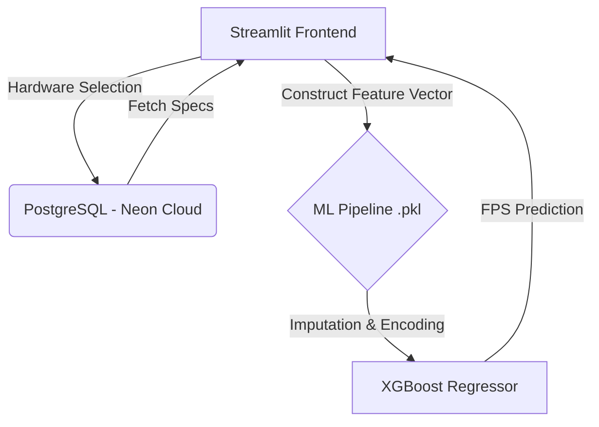

# 🎮 FPS Oracle: AI-Powered Frame Rate Predictor


An end-to-end Machine Learning web application designed to predict gaming performance (FPS) based on hardware specifications and in-game settings. 

This project serves as a **Proof of Concept (PoC)** demonstrating a complete production pipeline: from complex ML data preprocessing and model serialization to serverless cloud database integration and a custom-styled frontend.

##  System Architecture



##  Key Features
- **Production-Ready ML Pipeline:** Utilizes a robust scikit-learn pipeline encompassing multiple ColumnTransformer steps, SimpleImputer strategies, TargetEncoder for high-cardinality categorical variables, and an XGBoost estimator.
- **Serverless Cloud Database:** Hardware specifications (CPUs, GPUs) and game titles are fetched dynamically from a cloud-hosted PostgreSQL database (Neon) using SQLAlchemy, eliminating the need for local static files.
- **Cyberpunk Aesthetic UI:** A heavily customized Streamlit interface using raw CSS design tokens to create a futuristic, dark-themed gaming dashboard.
- **Graceful Error Handling & Validation:** Built-in safeguards against version mismatches, database connection drops, and empty spec queries.

## 🛠️ Tech Stack
- **Machine Learning:** scikit-learn, xgboost, category_encoders, pandas, joblib
- **Backend & DB:** SQLAlchemy, psycopg2-binary, python-dotenv, PostgreSQL (Neon.tech)
- **Frontend:** Streamlit, Custom HTML/CSS

##  Getting Started

### 1. Clone the Repository
```bash
git clone [https://github.com/a7med-830/FPS-Oracle.git](https://github.com/a7med-830/FPS-Oracle.git)
cd FPS-Oracle
```

### 2. Environment Setup
It is highly recommended to use a virtual environment to ensure model compatibility (specifically scikit-learn==1.7.2 to avoid unpickling errors).

```bash
python -m venv venv
source venv/bin/activate  # On Windows use: venv\Scripts\activate
pip install -r requirements.txt
```

### 3. Database Configuration
Create a `.env` file in the root directory and add your PostgreSQL connection string:

```env
DB_URL="postgresql+psycopg2://<user>:<password>@<neon_host>/<dbname>?sslmode=require"
MODEL_PATH="fps_predictor_pipeline.pkl"
```

### 4. Seed the Cloud Database
Migrate the raw benchmark data to your cloud database using the provided seed script:

```bash
python seed_db.py
```

### 5. Run the Application
```bash
streamlit run App.py
```

##  The ML Pipeline Deep Dive
The core of this application is a serialized pipeline trained on hardware benchmarks.

- **Numerical Features:** Processed using `SimpleImputer(strategy='median')` and scaled via `StandardScaler`.
- **Low-Cardinality Categoricals:** Handled with Most Frequent imputation and `OneHotEncoder`.
- **High-Cardinality Categoricals:** (e.g., CPU Name, GPU Name) Encoded using `TargetEncoder` to capture the non-linear relationship between specific hardware models and FPS output without exploding the feature space.
- **Estimator:** Tuned `XGBRegressor` optimizing for non-linear hardware bottlenecks.

> **Note:** The current dataset utilizes legacy benchmark data to validate the architecture. Future iterations will include a retrained model on current-gen hardware benchmarks.

##  Author
**Ahmed Hamdy** - Machine Learning Engineer  
[GitHub Profile](https://github.com/a7med-830)

 Author
Ahmed Hamdy - Machine Learning Engineer

GitHub Profile
